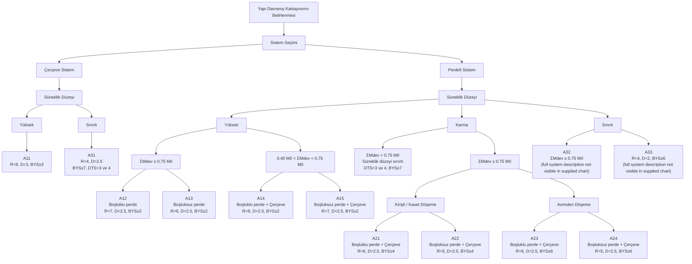

# TBDY R System Selection Algorithm Chart — Reference Register

Status: `REFERENCE_ONLY_PENDING_SOURCE_VERIFICATION`

Purpose: preserve the user-supplied **"R Katsayısının Seçim Nedeni / Yapı Davranış Katsayısının Belirlenmesi"** decision chart as an engineering-algorithm reference for the future system-classification / R-D eligibility engine.

This document is **not yet regulatory runtime authority**. Before any branch below is allowed to issue `R`, `D`, `Axx`, `PASS/FAIL`, or system-eligibility authority, the exact conditions and symbols must be verified against the governing TBDY source (especially the applicable structural-system table and the definitions/application rules for `ΣMdev`, `M0`, DTS and BYS).

## Source-preservation rules

- Preserve the chart as supplied; do not silently normalize ambiguous labels.
- System classification must be derived from factual/reviewed structural-system evidence, never from the requested `R` value alone.
- `R` and `D` are outputs of the classification path, not inputs that may authorize the path.
- Boundary inequalities must be source-exact before runtime implementation.
- The visible chart does not provide full textual system descriptions for `A32` and `A33`; do not invent them.
- The chart is a decision aid/reference. TBDY remains regulatory authority.

## Chart transcription



## Visible decision table

| Branch | Visible condition/system label | Visible output |
|---|---|---|
| A11 | Çerçeve sistem — yüksek süneklik | `R=8`, `D=3`, `BYS≥3` |
| A31 | Çerçeve sistem — sınırlı süneklik | `R=4`, `D=2.5`, `BYS≥7`, `DTS=3 ve 4` |
| A12 | Yüksek süneklik, `ΣMdev ≥ 0.75M0`, boşluklu perde | `R=7`, `D=2.5`, `BYS≥2` |
| A13 | Yüksek süneklik, `ΣMdev ≥ 0.75M0`, boşluksuz perde | `R=6`, `D=2.5`, `BYS≥2` |
| A14 | Yüksek süneklik, `0.40M0 < ΣMdev < 0.75M0`, boşluklu perde + çerçeve | `R=8`, `D=2.5`, `BYS≥2` |
| A15 | Yüksek süneklik, `0.40M0 < ΣMdev < 0.75M0`, boşluksuz perde + çerçeve | `R=7`, `D=2.5`, `BYS≥2` |
| A21 | Karma, `ΣMdev ≥ 0.75M0`, kirişli/kaset döşeme, boşluklu perde + çerçeve | `R=6`, `D=2.5`, `BYS≥4` |
| A22 | Karma, `ΣMdev ≥ 0.75M0`, kirişli/kaset döşeme, boşluksuz perde + çerçeve | `R=5`, `D=2.5`, `BYS≥4` |
| A23 | Karma, `ΣMdev ≥ 0.75M0`, asmolen döşeme, boşluklu perde + çerçeve | `R=6`, `D=2.5`, `BYS≥6` |
| A24 | Karma, `ΣMdev ≥ 0.75M0`, asmolen döşeme, boşluksuz perde + çerçeve | `R=5`, `D=2.5`, `BYS≥6` |
| A32 | Sınırlı branch; chart visibly shows `ΣMdev ≥ 0.75M0` | **description/output incomplete in supplied chart — verify from TBDY** |
| A33 | Sınırlı branch; chart visibly shows `R=4`, `D=2`, `BYS≥6` | **full system description incomplete in supplied chart — verify from TBDY** |

The chart also visibly contains a mixed-system branch with `ΣMdev < 0.75M0`, "Süneklik düzeyi sınırlı", `DTS=3 ve 4`, `BYS≥7`; the exact Axx mapping/eligibility semantics must be source-verified before implementation.

## Intended future engine contract

The production implementation should not be an image-specific `if/elif` script. It should become a source-bound system-selection engine with a canonical result such as:

```text
factual/reviewed structural system evidence
    ↓
SystemFamilyClassifier
    ↓
ductility classification
    ↓
wall-frame participation / ΣMdev-to-M0 rule
    ↓
slab-system rule where applicable
    ↓
DTS + BYS eligibility
    ↓
TBDY Axx structural-system class
    ↓
R + D
    ↓
SystemSelectionResult + evidence refs + authority refs + blocked reasons
```

Candidate input facts (subject to source verification):

- resisting-system family: frame / wall / wall+frame;
- ductility level;
- coupled (`boşluklu`) vs uncoupled (`boşluksuz`) wall system;
- `ΣMdev` and `M0` with exact TBDY definitions and direction/load-state provenance;
- floor/slab system where the table requires it;
- DTS;
- BYS;
- system-specific applicability restrictions.

Canonical output should include at least:

```text
system_class_code: A11/A12/.../A33
R
D
eligibility_status
system_family
resolved_branch_path
input_provenance
regulatory_authority_refs
blocked_reasons
```

## Runtime guardrail

Until the chart is verified against the governing TBDY clauses/tables, runtime behavior must be:

```text
REFERENCE_ONLY_PENDING_SOURCE_VERIFICATION
→ no automatic Axx promotion
→ no automatic R/D authority
→ no PASS/FAIL based on this chart alone
```
